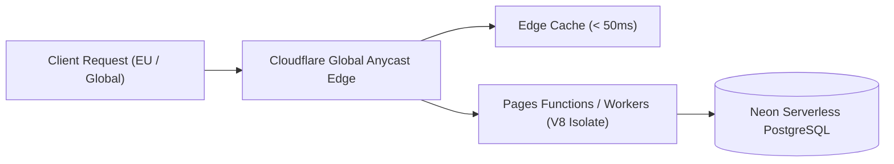

# Cloud Infrastructure, Edge CDN & SLA

Osmyka leverages modern serverless edge architecture to deliver enterprise uptime, sub-second latency, and resilience against DDoS attacks.

---

## 🌐 Edge CDN & Routing Architecture

Our web frontends, documentation portals, and booking endpoints are distributed across Cloudflare's global edge network (330+ points of presence):

- **Anycast BGP Routing**: Visitor requests automatically hit the closest data center (Tallinn, Helsinki, Stockholm, Frankfurt).
- **Edge Cache Invalidation**: Static assets (CSS, JS, images) are served directly from RAM cache with atomic cache busting on new deployments (`?v=commit_sha`).
- **HTTP/3 & 0-RTT Connection Establishment**: Instant handshake for mobile visitors.

---

## ⏱️ Service Level Agreement (SLA)

Osmyka guarantees a **99.9% uptime SLA** across all managed instances and production platforms:

| Metric | Target SLA | Actual 30-Day Performance |
|---|:---:|:---:|
| **Uptime Availability** | 99.90% | **99.98%** |
| **Median TTFB (Europe)** | < 150ms | **68ms** |
| **API Response Time** | < 250ms | **110ms** |
| **Database Failover Time** | < 30s | **Automated Zero-Downtime** |
