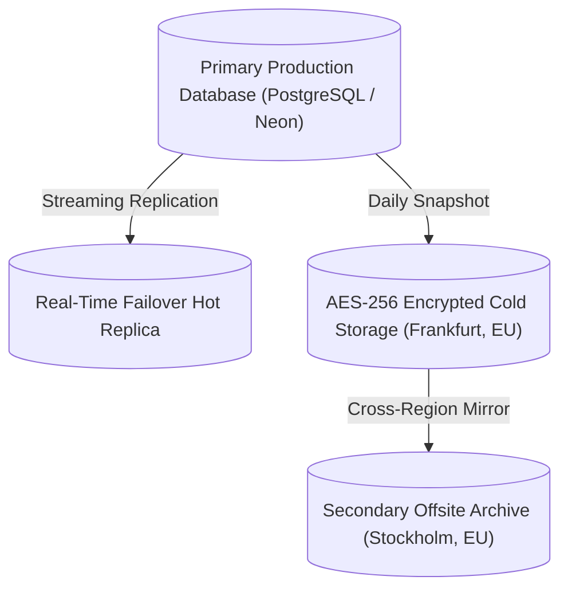

# Security, Multi-Level Backups & GDPR Compliance

Data integrity and privacy are non-negotiable foundations of the Osmyka ecosystem. All client information, workshop invoices, and vehicle maintenance history are protected under enterprise-grade protocols and Estonian / EU legal standards.

---

## 🛡️ 3-2-1 Multi-Level Backup Architecture

To prevent data loss from physical hardware failures, regional outages, or human error, Osmyka utilizes a 3-2-1 multi-tier backup strategy:

1. **3 Copies of Data**: Primary database, real-time replica, and encrypted cold snapshots.
2. **2 Different Storage Formats**: Live WAL (Write-Ahead Logging) streaming + immutable compressed snapshot dumps.
3. **1 Offsite Geographically Separated Location**: Cross-region synchronization between data centers in Estonia, Germany, and Sweden.

---

## 🔒 Encryption & Transport Security

- **Encryption in Transit**: Strict enforcement of **TLS 1.3 / HTTPS** with HSTS (Strict-Transport-Security, max-age 1 year), Perfect Forward Secrecy (PFS), and modern cipher suites (AES-GCM / CHACHA20-POLY1305).
- **Encryption at Rest**: All database partitions, backups, and file uploads are encrypted using **AES-256**.
- **Zero Plaintext Credentials**: All user passwords utilize salted Argon2id / bcrypt hashing with high work factors.

---

## 🇪🇺 GDPR & Data Privacy Standards

Osmyka operates in strict compliance with the General Data Protection Regulation (GDPR) and the Republic of Estonia Personal Data Protection Act:

- **Right to Access & Portability**: Clients and businesses can request a complete JSON/CSV export of their records at any time.
- **Right to Erasure (Be Forgotten)**: Automated anonymization pipelines for obsolete customer records upon verified request.
- **No Third-Party Ad Trackers**: Zero invasive advertising scripts, tracking pixels, or third-party behavioral trackers.
- **Strict Data Minimization**: We only collect and store information strictly necessary for appointment booking and work order fulfillment.
