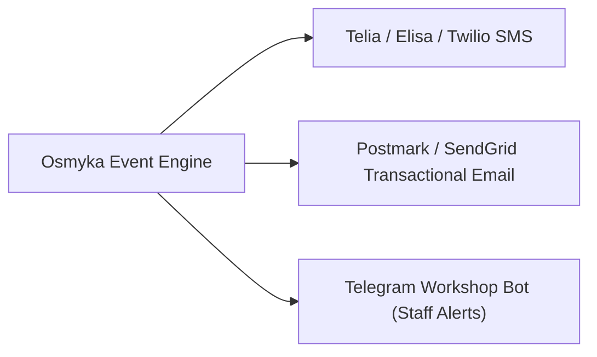

# Notification Gateways & Alert Pipelines

The Osmyka platform connects to SMS gateways, transactional email dispatchers, and Telegram bot notification pipelines to keep clients and workshop staff informed in real time.

---

## 📱 Supported Notification Channels

### 1. SMS Gateways (Estonia & Baltic Region)
- Direct integration with local Baltic telecom operators (Telia, Elisa, Tele2) and global gateways (Twilio, MessageBird, Messente).
- Alphanumeric sender ID support (e.g. sender shows as `YourAuto`).
- Dynamic template variables (`{{client_name}}`, `{{vehicle_plate}}`, `{{pickup_time}}`).

### 2. Transactional Email
- Delivery of PDF invoices, inspection diagnostic reports, and booking confirmations.
- DKIM, SPF, and DMARC alignment for guaranteed inbox delivery.

### 3. Telegram Staff Bot
- Mechanics receive instant push alerts on assigned work orders.
- Management receives daily revenue digests, inventory restock alerts, and cancellation warnings.
