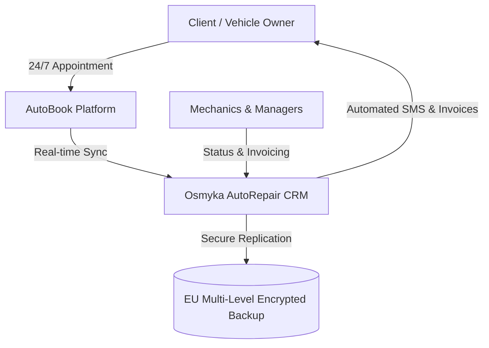

# Welcome to Osmyka Knowledge Hub

**Osmyka OÜ** develops custom, high-reliability software solutions designed for auto repair shops, specialized technical services, and growing small-to-medium businesses across Estonia and the European Union.

This documentation portal contains comprehensive guides, technical specifications, release notes, architecture references, and API documentation for our core platform products and bespoke implementations.

---

## 🚀 Core Product Ecosystem

Our solutions are engineered without bloated dependencies, providing lightning-fast execution, military-grade data protection, and seamless cross-device workflows:

### 1. [AutoBook 24/7 Online Booking Platform](./products/autobook.md)
Self-service appointment scheduling for vehicle owners with live lift/bay availability, service duration calculators, and automated client SMS confirmations.

### 2. [Osmyka AutoRepair CRM Platform](./products/custom-crm.md)
Centralized workshop operating system: Work order lifecycle tracking, VIN decoding, parts catalog search, mechanic job allocation, and 1-click accounting/invoicing.

### 3. [Turnkey High-Speed Web Portals](./products/turnkey-web.md)
Custom-built business websites and web utilities featuring sub-second TTFB, edge CDN distribution, mobile-first interfaces, and built-in lead capture pipelines.

---

## 🛠️ Architecture & Reliability

- **[Security & Multi-Level Backups](./architecture/security-and-backups.md)** — Learn about our 3-2-1 backup strategy, AES-256 data encryption at rest, and GDPR-compliant Estonian cloud infrastructure.
- **[Cloud Infrastructure & Edge Caching](./architecture/cloud-infrastructure.md)** — Global Cloudflare CDN routing, SSL/TLS 1.3 strict enforcement, and 99.9% uptime SLA.
- **[UI Element System](./architecture/element-system.md)** — Design tokens, CSS components, and accessibility guidelines powering the Osmyka UI.

---

## 📦 Releases & Integrations

- **[Version Releases & Changelog](./releases/v2.0.0.md)** — Detailed changelogs and release notes for every product upgrade.
- **[REST API & Webhooks](./integrations/api-reference.md)** — Integrate external services, trigger custom webhooks on work order state changes, and connect third-party ERPs.
- **[Notification Providers](./integrations/notifications.md)** — SMS gateways, email dispatchers, and Telegram bot notification channels.

---

## 💬 Getting Support

For technical consultations, custom system integrations, or deployment inquiries:
- **Email:** [info@osmyka.com](mailto:info@osmyka.com)
- **Company:** Osmyka OÜ (Reg. code: 17351656)
- **Location:** Tallinn, Estonia
