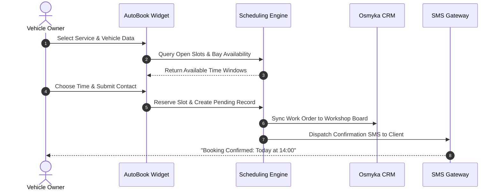

# AutoBook 24/7 Online Booking Platform

**AutoBook** is an automated self-service appointment scheduling engine built specifically for auto repair workshops, tire service centers, detailing studios, and vehicle inspection stations.

---

## 🔑 Key Capabilities

1. **Intelligent Lift & Post Allocation**
   - Automatically checks lift availability, technician specializations, and bay equipment.
   - Prevents double bookings and optimizes workshop floor throughput.

2. **Vehicle & Service Intelligence**
   - Registration plate & VIN input with automatic vehicle model recognition.
   - Dynamic service duration estimation based on vehicle type (e.g. standard oil change vs. complex 4WD suspension overhaul).

3. **Client Self-Service & Notifications**
   - 24/7 self-service scheduling without phone queue delays.
   - Instant SMS & email confirmation with calendar `.ics` invite attachments.
   - 2-hour and 24-hour reminder SMS dispatch to reduce no-shows.

4. **Embeddable Widget & Whitelabel Portals**
   - Seamless iframe or web-component embed for existing websites.
   - Standalone branded subdomain (e.g. `booking.your-service.ee`).

---

## 📐 Architecture Flow



---

## ⚙️ Configuration & Customization

AutoBook supports full parametric customization through the administrative panel:

```json
{
  "workshopId": "ws-tallinn-01",
  "operatingHours": {
    "monday_friday": "08:00-19:00",
    "saturday": "09:00-16:00",
    "sunday": "closed"
  },
  "lifts": [
    { "id": "lift-1", "type": "two_post", "maxWeightKg": 3500 },
    { "id": "lift-2", "type": "four_post_alignment", "maxWeightKg": 5000 },
    { "id": "bay-3", "type": "diagnostics_station", "maxWeightKg": 4000 }
  ],
  "leadTimeMinutes": 30,
  "slotIntervalMinutes": 15,
  "reminderLeadHours": 24
}
```

---

## 📈 Business Impact

- **+35%** increase in off-hours customer bookings (evening & weekend requests).
- **-80%** reduction in phone calls spent manually writing down car registration numbers and finding time slots.
- **-92%** reduction in missed appointments through automated two-way SMS reminders.
