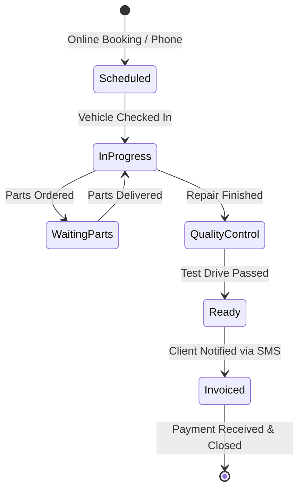

# Osmyka AutoRepair CRM Platform

The **Osmyka AutoRepair CRM** is an end-to-end operational software suite designed specifically for vehicle service centers, independent garages, and fleet maintenance shops.

---

## 🚀 Core Modules

### 1. Interactive Work Order Board (Kanban & Timeline)
- Live visual overview of jobs in progress: **Accepted → Diagnostics → Waiting for Parts → Repairing → Quality Check → Ready for Pickup**.
- Color-coded urgency indicators, vehicle license plate badges, and assigned mechanic avatars.
- Drag-and-drop status transitions with automatic real-time event triggers.

### 2. Vehicle Profile & Complete Service History
- Full audit log of every repair ever conducted on each vehicle by VIN or License Plate.
- Mileage progression graphs and periodic maintenance recommendations (timing belt, oil, brake pads).
- Direct upload of diagnostics photos, inspection checklists, and scan tool printouts.

### 3. Parts Catalog & Supplier Requisition
- Direct supplier inventory search (Inter Cars, Bapco, Sparex, AutoDoc APIs).
- Automated markup calculations, wholesale vs. retail margin tracking, and part delivery status.
- Low-stock warehouse alerts for high-turnover consumables (filters, oils, brake fluids).

### 4. 1-Click Billing & PDF Invoicing
- Instant generation of itemized client estimates and tax invoices.
- Supports EU VAT standards (0%, 24% EE VAT, reverse charge).
- Direct email dispatch with PDF attachment and online payment gateway links.

---

## 📊 Work Order State Machine

---

## 🔒 Security & Role-Based Access Control (RBAC)

The CRM enforces granular role permissions:

| Permission / Action | Master / Owner | Service Manager | Technician / Mechanic | Accountant |
|---|:---:|:---:|:---:|:---:|
| View All Financial Reports & Profit Margins | ✅ | ❌ | ❌ | ✅ |
| Create / Edit Work Orders | ✅ | ✅ | ❌ | ❌ |
| Update Repair Checklist & Log Hours | ✅ | ✅ | ✅ | ❌ |
| Issue & Send Invoices | ✅ | ✅ | ❌ | ✅ |
| Access Raw Database & Backups | ✅ | ❌ | ❌ | ❌ |

---

## 📱 Mobile & Tablet Mechanic Mode

Mechanics on the workshop floor can access a dedicated high-contrast mobile view on waterproof tablets:
- Large touch buttons for one-tap checklist item completion.
- Camera barcode scanning for rapid part assignment to work orders.
- Voice-to-text dictation for mechanic notes during underbody inspection.
